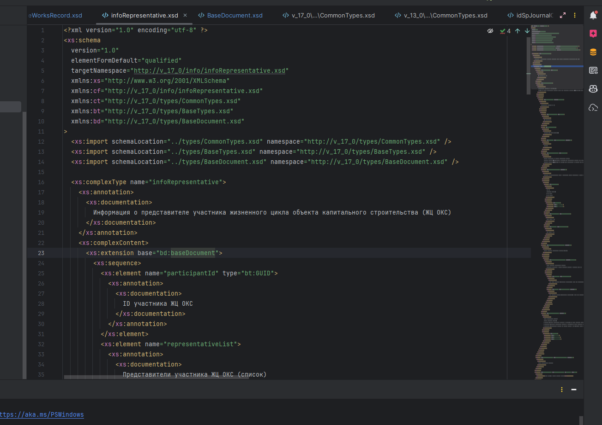
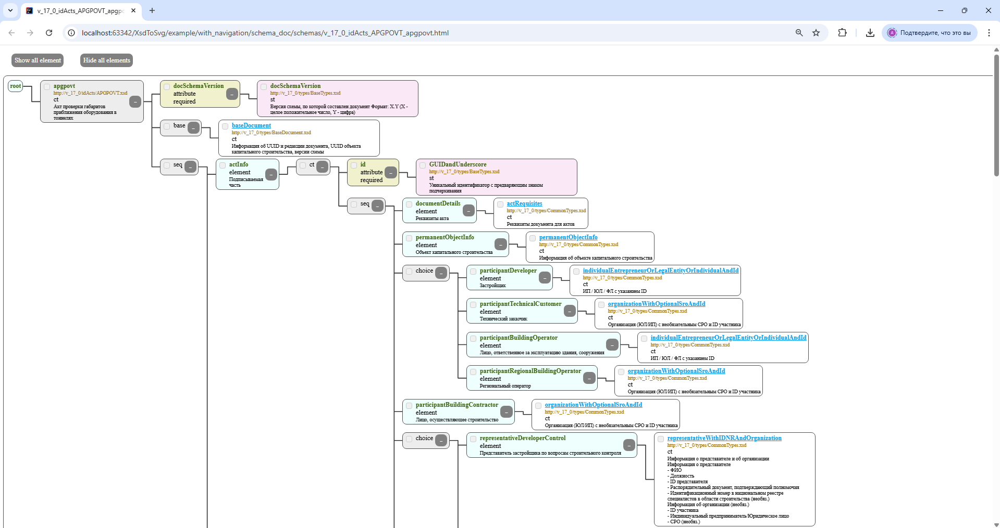

# XsdVisualizer

XsdVisualizer is a Java-based application designed to parse XML Schema Definitions (XSD) and generate visual representations in HTML format. The application supports two modes of operation: generating a single schema visualization or creating a navigation table for multiple schemas.

## Features
- Parse XSD files or directories containing multiple XSDs.
- Generate HTML visualizations of XSD structures.
- Create navigation tables for easier exploration of multiple schemas.
- UTF-8 support for proper rendering of international characters.

## Requirements
- Java 17 or higher
- Maven 3.6+ (for building the project)

## Installation
1. Clone the repository:
   ```bash
   git clone https://github.com/denis00001232/XsdVisualizer.git
   ```
2. Navigate to the project directory:
   ```bash
   cd XsdVisualizer
   ```
3. Build the project using Maven:
   ```bash
   mvn clean package
   ```

## Download

You can download the latest release of XsdVisualizer from the [Releases](https://github.com/denis00001232/XsdVisualizer/releases) page.

## Usage
After downloading the application(or building project), you can run it using the following commands:

### Generate a Single Schema Visualization
```bash
java -jar target/XsdVisualizer.jar path/to/xsd -s
```
- `path/to/xsd`: Path to the XSD file or directory.
- `-s`: Mode for generating a single schema visualization.

### Generate a Navigation Table
```bash
java -jar target/XsdVisualizer.jar path/to/xsd -t
```
- `path/to/xsd`: Path to the XSD file or directory.
- `-t`: Mode for generating a navigation table.

## Example
### Input
An XSD file:
```xml
<xs:schema xmlns:xs="http://www.w3.org/2001/XMLSchema">
    <xs:element name="person">
        <xs:complexType>
            <xs:sequence>
                <xs:element name="firstName" type="xs:string"/>
                <xs:element name="lastName" type="xs:string"/>
            </xs:sequence>
        </xs:complexType>
    </xs:element>
</xs:schema>
```

### Output
The application generates an HTML file visualizing the structure of the XSD.

### Examples Folder
The `example` folder in the project contains sample input XSD files and their corresponding output HTML files. You can use these examples to understand the application's functionality or test it with predefined data.

## Demonstration

Below are examples of how the application transforms XSD files into visual HTML representations.

#### Before (XSD File):


#### After (Generated HTML):


## Advantages

- **Performance**: The application is optimized to handle even large XSD files without lagging.
- **Accessibility**: Generated HTML schemas can be opened by any user, even if they do not have the application installed.
- **Modular Output**: Schemas can be generated in a mode where all complex types are split into separate files, allowing easy navigation between them.

## Contributing
Contributions are welcome! If you find a bug or have a feature request, please open an issue or submit a pull request.

## License
This project is licensed under the MIT License. See the [LICENSE](LICENSE) file for details.

## Acknowledgments
- [Jsoup](https://jsoup.org/) for HTML manipulation.
- [Eclipse XSD](https://projects.eclipse.org/projects/modeling.xsd) for XSD parsing.

## Output Files

All generated files are stored in the following locations:
- **Schemas**: HTML files representing individual XSD schemas are saved in the `schemas` directory specified in the configuration.
- **Navigation Table**: The navigation table HTML file is saved in the `navigation` directory specified in the configuration.

By default, these directories are created in the working directory of the application. You can customize these paths in the configuration file or programmatically.
